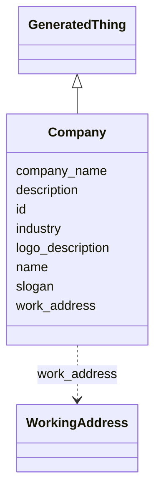

# Class: Company
_A corporate entity._


URI: [mug:Company](https://w3id.org/caufieldjh-in-space/mug_schemas/Company)





## Inheritance
* [NamedThing](NamedThing.md)
    * [GeneratedThing](GeneratedThing.md)
        * **Company**


## Slots

| Name | Cardinality and Range | Description | Inheritance |
| ---  | --- | --- | --- |
| [company_name](company_name.md) | 0..1 <br/> [String](String.md) |  | direct |
| [work_address](work_address.md) | 0..* <br/> [WorkingAddress](WorkingAddress.md) | One or more addresses where a person may work | direct |
| [industry](industry.md) | 0..1 <br/> [String](String.md) |  | direct |
| [slogan](slogan.md) | 0..1 <br/> [String](String.md) |  | direct |
| [logo_description](logo_description.md) | 0..1 <br/> [String](String.md) |  | direct |
| [id](id.md) | 1..1 <br/> [Uriorcurie](Uriorcurie.md) | A unique identifier for a thing | [NamedThing](NamedThing.md) |
| [name](name.md) | 0..1 <br/> [String](String.md) | A human-readable name for a thing | [NamedThing](NamedThing.md) |
| [description](description.md) | 0..1 <br/> [String](String.md) | A human-readable description for a thing | [NamedThing](NamedThing.md) |


## Usages

| used by | used in | type | used |
| ---  | --- | --- | --- |
| [WorkingAddress](WorkingAddress.md) | [addressee](addressee.md) | range | [Company](Company.md) |


## Identifier and Mapping Information


### Schema Source


* from schema: https://w3id.org/my-org/mug_schemas


## Mappings

| Mapping Type | Mapped Value |
| ---  | ---  |
| self | mug:Company |
| native | mug:Company |


## LinkML Source

<!-- TODO: investigate https://stackoverflow.com/questions/37606292/how-to-create-tabbed-code-blocks-in-mkdocs-or-sphinx -->

### Direct

<details>
```yaml
name: Company
description: A corporate entity.
from_schema: https://w3id.org/my-org/mug_schemas
rank: 1000
is_a: GeneratedThing
slots:
- company_name
- work_address
- industry
- slogan
- logo_description

```
</details>

### Induced

<details>
```yaml
name: Company
description: A corporate entity.
from_schema: https://w3id.org/my-org/mug_schemas
rank: 1000
is_a: GeneratedThing
attributes:
  company_name:
    name: company_name
    from_schema: https://w3id.org/my-org/mug_schemas
    rank: 1000
    alias: company_name
    owner: Company
    domain_of:
    - Company
    range: string
  work_address:
    name: work_address
    description: One or more addresses where a person may work.
    from_schema: https://w3id.org/my-org/mug_schemas
    rank: 1000
    multivalued: true
    alias: work_address
    owner: Company
    domain_of:
    - Person
    - Company
    range: WorkingAddress
  industry:
    name: industry
    from_schema: https://w3id.org/my-org/mug_schemas
    rank: 1000
    alias: industry
    owner: Company
    domain_of:
    - Company
    range: string
  slogan:
    name: slogan
    from_schema: https://w3id.org/my-org/mug_schemas
    rank: 1000
    alias: slogan
    owner: Company
    domain_of:
    - Company
    range: string
  logo_description:
    name: logo_description
    from_schema: https://w3id.org/my-org/mug_schemas
    rank: 1000
    alias: logo_description
    owner: Company
    domain_of:
    - Company
    range: string
  id:
    name: id
    description: A unique identifier for a thing
    from_schema: https://w3id.org/my-org/mug_schemas
    rank: 1000
    slot_uri: schema:identifier
    identifier: true
    alias: id
    owner: Company
    domain_of:
    - NamedThing
    range: uriorcurie
  name:
    name: name
    description: A human-readable name for a thing
    from_schema: https://w3id.org/my-org/mug_schemas
    rank: 1000
    slot_uri: schema:name
    alias: name
    owner: Company
    domain_of:
    - NamedThing
    range: string
  description:
    name: description
    description: A human-readable description for a thing. For a GeneratedThing, this
      will be one potential string representation of the object.
    from_schema: https://w3id.org/my-org/mug_schemas
    rank: 1000
    slot_uri: schema:description
    alias: description
    owner: Company
    domain_of:
    - NamedThing
    range: string

```
</details>