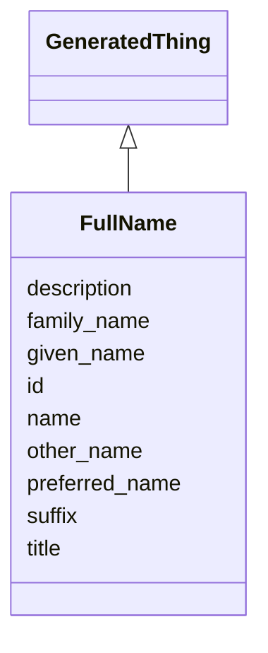

# Class: FullName
_All parts of a name._


URI: [mug:FullName](https://w3id.org/caufieldjh-in-space/mug_schemas/FullName)





## Inheritance
* [NamedThing](NamedThing.md)
    * [GeneratedThing](GeneratedThing.md)
        * **FullName**


## Slots

| Name | Cardinality and Range | Description | Inheritance |
| ---  | --- | --- | --- |
| [given_name](given_name.md) | 0..* <br/> [String](String.md) | A given name | direct |
| [family_name](family_name.md) | 0..* <br/> [String](String.md) | A family name | direct |
| [other_name](other_name.md) | 0..* <br/> [String](String.md) | A middle name or names, usually, or at least a name usually presented in betw... | direct |
| [preferred_name](preferred_name.md) | 0..* <br/> [String](String.md) | Any name used to refer to a specific Person | direct |
| [title](title.md) | 0..* <br/> [String](String.md) | A formal or informal prefix for a name | direct |
| [suffix](suffix.md) | 0..* <br/> [String](String.md) | A formal or informal postfix for a name | direct |
| [id](id.md) | 1..1 <br/> [Uriorcurie](Uriorcurie.md) | A unique identifier for a thing | [NamedThing](NamedThing.md) |
| [name](name.md) | 0..1 <br/> [String](String.md) | A human-readable name for a thing | [NamedThing](NamedThing.md) |
| [description](description.md) | 0..1 <br/> [String](String.md) | A human-readable description for a thing | [NamedThing](NamedThing.md) |


## Usages

| used by | used in | type | used |
| ---  | --- | --- | --- |
| [Person](Person.md) | [full_name](full_name.md) | range | [FullName](FullName.md) |


## Identifier and Mapping Information


### Schema Source


* from schema: https://w3id.org/my-org/mug_schemas


## Mappings

| Mapping Type | Mapped Value |
| ---  | ---  |
| self | mug:FullName |
| native | mug:FullName |


## LinkML Source

<!-- TODO: investigate https://stackoverflow.com/questions/37606292/how-to-create-tabbed-code-blocks-in-mkdocs-or-sphinx -->

### Direct

<details>
```yaml
name: FullName
description: All parts of a name.
from_schema: https://w3id.org/my-org/mug_schemas
rank: 1000
is_a: GeneratedThing
slots:
- given_name
- family_name
- other_name
- preferred_name
- title
- suffix

```
</details>

### Induced

<details>
```yaml
name: FullName
description: All parts of a name.
from_schema: https://w3id.org/my-org/mug_schemas
rank: 1000
is_a: GeneratedThing
attributes:
  given_name:
    name: given_name
    description: A given name. May be a mononym (i.e., the only name). When multivalued,
      implies spaces in between names.
    examples:
    - value: Frances
    - value: Mary Kate
    - value: Sinbad
    from_schema: https://w3id.org/my-org/mug_schemas
    aliases:
    - first name
    - forename
    rank: 1000
    multivalued: true
    alias: given_name
    owner: FullName
    domain_of:
    - FullName
    range: string
  family_name:
    name: family_name
    description: A family name. Optional, so mononyms should go in given_name. For
      multvalued names like  "Duarte de Perón", the "de" particle should be part of
      the second name, not its own value.
    examples:
    - value: Quigley
    - value: Branson-Danforth
    - value: de Souza
    from_schema: https://w3id.org/my-org/mug_schemas
    aliases:
    - last name
    - surname
    rank: 1000
    multivalued: true
    alias: family_name
    owner: FullName
    domain_of:
    - FullName
    range: string
  other_name:
    name: other_name
    description: A middle name or names, usually, or at least a name usually presented
      in between a given_name and a family_name.
    from_schema: https://w3id.org/my-org/mug_schemas
    aliases:
    - middle name
    rank: 1000
    multivalued: true
    alias: other_name
    owner: FullName
    domain_of:
    - FullName
    range: string
  preferred_name:
    name: preferred_name
    description: Any name used to refer to a specific Person. Often presented in quotes,
      but that doesn't have to be the case here.
    examples:
    - value: Jimmy
    - value: The Brick
    - value: xXDarksoul920Xx
    from_schema: https://w3id.org/my-org/mug_schemas
    aliases:
    - nickname
    - pet name
    - pseudonym
    rank: 1000
    multivalued: true
    alias: preferred_name
    owner: FullName
    domain_of:
    - FullName
    range: string
  title:
    name: title
    description: A formal or informal prefix for a name. Use the full version, not
      an abbreviation.
    examples:
    - value: Lady
    - value: Captain
    - value: His Holiness
    from_schema: https://w3id.org/my-org/mug_schemas
    aliases:
    - prenominative
    rank: 1000
    multivalued: true
    alias: title
    owner: FullName
    domain_of:
    - FullName
    range: string
  suffix:
    name: suffix
    description: A formal or informal postfix for a name. Use the full version, not
      an abbreviation. These can get messy about commas and such, but that's not a
      problem to be solved here.
    examples:
    - value: Jr
    - value: IV
    - value: CEO
    - value: Professor Emeritus
    from_schema: https://w3id.org/my-org/mug_schemas
    aliases:
    - postnominative
    rank: 1000
    multivalued: true
    alias: suffix
    owner: FullName
    domain_of:
    - FullName
    range: string
  id:
    name: id
    description: A unique identifier for a thing
    from_schema: https://w3id.org/my-org/mug_schemas
    rank: 1000
    slot_uri: schema:identifier
    identifier: true
    alias: id
    owner: FullName
    domain_of:
    - NamedThing
    range: uriorcurie
  name:
    name: name
    description: A human-readable name for a thing
    from_schema: https://w3id.org/my-org/mug_schemas
    rank: 1000
    slot_uri: schema:name
    alias: name
    owner: FullName
    domain_of:
    - NamedThing
    range: string
  description:
    name: description
    description: A human-readable description for a thing. For a GeneratedThing, this
      will be one potential string representation of the object.
    from_schema: https://w3id.org/my-org/mug_schemas
    rank: 1000
    slot_uri: schema:description
    alias: description
    owner: FullName
    domain_of:
    - NamedThing
    range: string

```
</details>