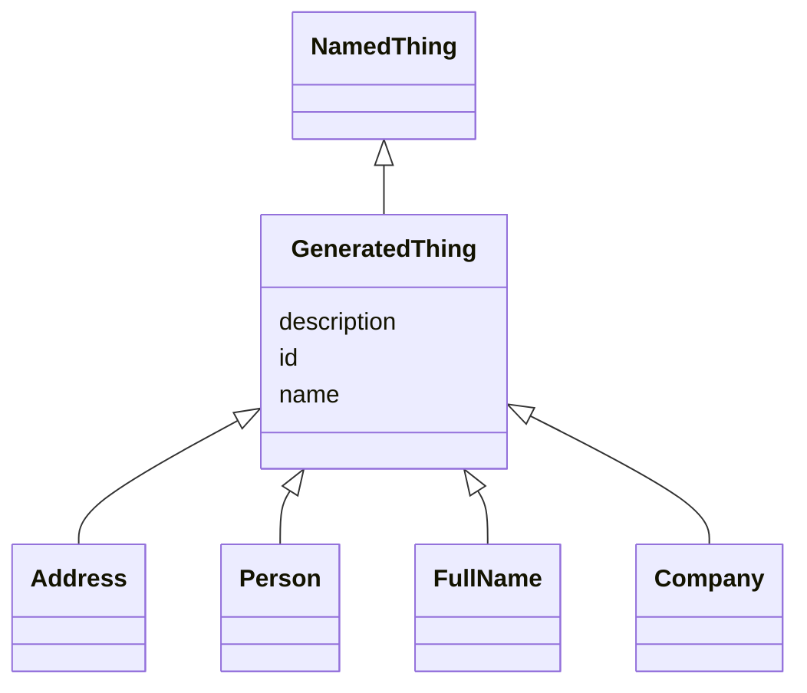

# Class: GeneratedThing
_Any set of data representing a single generated object. In MUG, this does not include the object's string representation, but rather all components used in generating that representation. Think of this like the ingredients list rather than the finished meal._


URI: [mug:GeneratedThing](https://w3id.org/caufieldjh-in-space/mug_schemas/GeneratedThing)





## Inheritance
* [NamedThing](NamedThing.md)
    * **GeneratedThing**
        * [Address](Address.md)
        * [Person](Person.md)
        * [FullName](FullName.md)
        * [Company](Company.md)


## Slots

| Name | Cardinality and Range | Description | Inheritance |
| ---  | --- | --- | --- |
| [id](id.md) | 1..1 <br/> [Uriorcurie](Uriorcurie.md) | A unique identifier for a thing | [NamedThing](NamedThing.md) |
| [name](name.md) | 0..1 <br/> [String](String.md) | A human-readable name for a thing | [NamedThing](NamedThing.md) |
| [description](description.md) | 0..1 <br/> [String](String.md) | A human-readable description for a thing | [NamedThing](NamedThing.md) |


## Usages

| used by | used in | type | used |
| ---  | --- | --- | --- |
| [GeneratedThingCollection](GeneratedThingCollection.md) | [entries](entries.md) | range | [GeneratedThing](GeneratedThing.md) |


## Identifier and Mapping Information


### Schema Source


* from schema: https://w3id.org/my-org/mug_schemas


## Mappings

| Mapping Type | Mapped Value |
| ---  | ---  |
| self | mug:GeneratedThing |
| native | mug:GeneratedThing |


## LinkML Source

<!-- TODO: investigate https://stackoverflow.com/questions/37606292/how-to-create-tabbed-code-blocks-in-mkdocs-or-sphinx -->

### Direct

<details>
```yaml
name: GeneratedThing
description: Any set of data representing a single generated object. In MUG, this
  does not include the object's string representation, but rather all components used
  in generating that representation. Think of this like the ingredients list rather
  than the finished meal.
from_schema: https://w3id.org/my-org/mug_schemas
rank: 1000
is_a: NamedThing

```
</details>

### Induced

<details>
```yaml
name: GeneratedThing
description: Any set of data representing a single generated object. In MUG, this
  does not include the object's string representation, but rather all components used
  in generating that representation. Think of this like the ingredients list rather
  than the finished meal.
from_schema: https://w3id.org/my-org/mug_schemas
rank: 1000
is_a: NamedThing
attributes:
  id:
    name: id
    description: A unique identifier for a thing
    from_schema: https://w3id.org/my-org/mug_schemas
    rank: 1000
    slot_uri: schema:identifier
    identifier: true
    alias: id
    owner: GeneratedThing
    domain_of:
    - NamedThing
    range: uriorcurie
  name:
    name: name
    description: A human-readable name for a thing
    from_schema: https://w3id.org/my-org/mug_schemas
    rank: 1000
    slot_uri: schema:name
    alias: name
    owner: GeneratedThing
    domain_of:
    - NamedThing
    range: string
  description:
    name: description
    description: A human-readable description for a thing. For a GeneratedThing, this
      will be one potential string representation of the object.
    from_schema: https://w3id.org/my-org/mug_schemas
    rank: 1000
    slot_uri: schema:description
    alias: description
    owner: GeneratedThing
    domain_of:
    - NamedThing
    range: string

```
</details>