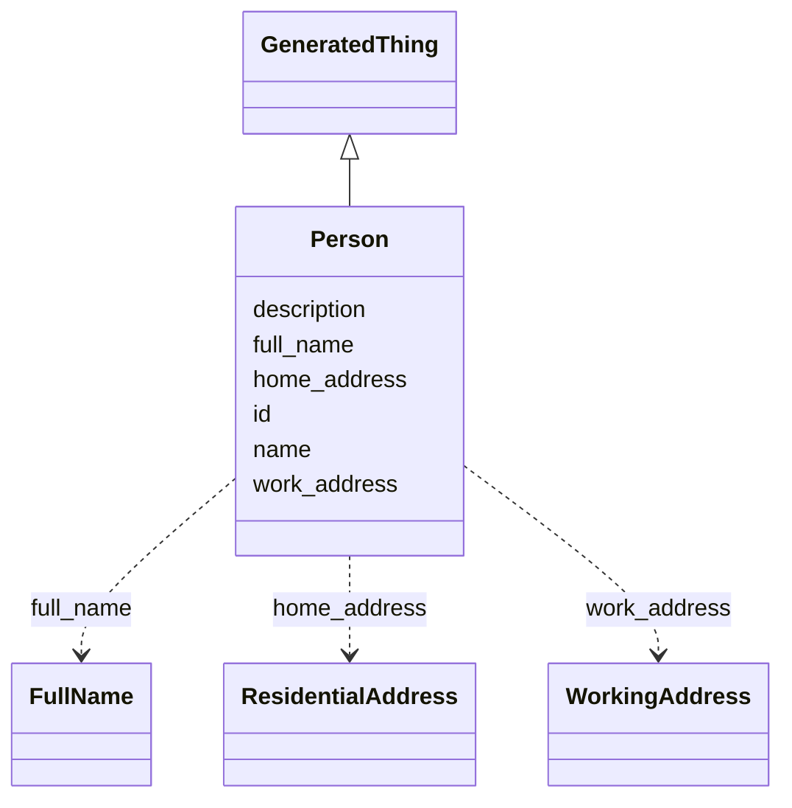

# Class: Person
_General class for people._


URI: [mug:Person](https://w3id.org/caufieldjh-in-space/mug_schemas/Person)





## Inheritance
* [NamedThing](NamedThing.md)
    * [GeneratedThing](GeneratedThing.md)
        * **Person**


## Slots

| Name | Cardinality and Range | Description | Inheritance |
| ---  | --- | --- | --- |
| [full_name](full_name.md) | 0..1 <br/> [FullName](FullName.md) | Slot for all name parts | direct |
| [home_address](home_address.md) | 0..* <br/> [ResidentialAddress](ResidentialAddress.md) | One or more addresses where a person may live | direct |
| [work_address](work_address.md) | 0..* <br/> [WorkingAddress](WorkingAddress.md) | One or more addresses where a person may work | direct |
| [id](id.md) | 1..1 <br/> [Uriorcurie](Uriorcurie.md) | A unique identifier for a thing | [NamedThing](NamedThing.md) |
| [name](name.md) | 0..1 <br/> [String](String.md) | A human-readable name for a thing | [NamedThing](NamedThing.md) |
| [description](description.md) | 0..1 <br/> [String](String.md) | A human-readable description for a thing | [NamedThing](NamedThing.md) |


## Usages

| used by | used in | type | used |
| ---  | --- | --- | --- |
| [ResidentialAddress](ResidentialAddress.md) | [addressee](addressee.md) | range | [Person](Person.md) |


## Identifier and Mapping Information


### Schema Source


* from schema: https://w3id.org/my-org/mug_schemas


## Mappings

| Mapping Type | Mapped Value |
| ---  | ---  |
| self | mug:Person |
| native | mug:Person |


## LinkML Source

<!-- TODO: investigate https://stackoverflow.com/questions/37606292/how-to-create-tabbed-code-blocks-in-mkdocs-or-sphinx -->

### Direct

<details>
```yaml
name: Person
description: General class for people.
from_schema: https://w3id.org/my-org/mug_schemas
rank: 1000
is_a: GeneratedThing
slots:
- full_name
- home_address
- work_address

```
</details>

### Induced

<details>
```yaml
name: Person
description: General class for people.
from_schema: https://w3id.org/my-org/mug_schemas
rank: 1000
is_a: GeneratedThing
attributes:
  full_name:
    name: full_name
    description: Slot for all name parts.
    from_schema: https://w3id.org/my-org/mug_schemas
    rank: 1000
    alias: full_name
    owner: Person
    domain_of:
    - Person
    range: FullName
  home_address:
    name: home_address
    description: One or more addresses where a person may live.
    from_schema: https://w3id.org/my-org/mug_schemas
    rank: 1000
    multivalued: true
    alias: home_address
    owner: Person
    domain_of:
    - Person
    range: ResidentialAddress
  work_address:
    name: work_address
    description: One or more addresses where a person may work.
    from_schema: https://w3id.org/my-org/mug_schemas
    rank: 1000
    multivalued: true
    alias: work_address
    owner: Person
    domain_of:
    - Person
    - Company
    range: WorkingAddress
  id:
    name: id
    description: A unique identifier for a thing
    from_schema: https://w3id.org/my-org/mug_schemas
    rank: 1000
    slot_uri: schema:identifier
    identifier: true
    alias: id
    owner: Person
    domain_of:
    - NamedThing
    range: uriorcurie
  name:
    name: name
    description: A human-readable name for a thing
    from_schema: https://w3id.org/my-org/mug_schemas
    rank: 1000
    slot_uri: schema:name
    alias: name
    owner: Person
    domain_of:
    - NamedThing
    range: string
  description:
    name: description
    description: A human-readable description for a thing. For a GeneratedThing, this
      will be one potential string representation of the object.
    from_schema: https://w3id.org/my-org/mug_schemas
    rank: 1000
    slot_uri: schema:description
    alias: description
    owner: Person
    domain_of:
    - NamedThing
    range: string

```
</details>