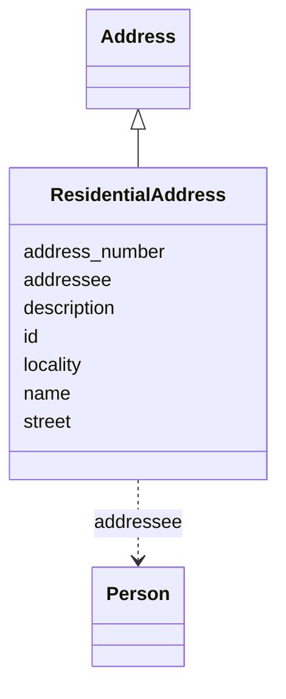

# Class: ResidentialAddress
_Address of a residential location._


URI: [mug:ResidentialAddress](https://w3id.org/caufieldjh-in-space/mug_schemas/ResidentialAddress)





## Inheritance
* [NamedThing](NamedThing.md)
    * [GeneratedThing](GeneratedThing.md)
        * [Address](Address.md)
            * **ResidentialAddress**


## Slots

| Name | Cardinality and Range | Description | Inheritance |
| ---  | --- | --- | --- |
| [addressee](addressee.md) | 1..1 <br/> [Person](Person.md) | The recipient of mail | [Address](Address.md) |
| [address_number](address_number.md) | 0..* <br/> [String](String.md) | The most specific component of a physical mailing address | [Address](Address.md) |
| [street](street.md) | 0..* <br/> [String](String.md) | The street component of a physical mailing address | [Address](Address.md) |
| [locality](locality.md) | 0..* <br/> [String](String.md) | The broadest component of a physical mailing address | [Address](Address.md) |
| [id](id.md) | 1..1 <br/> [Uriorcurie](Uriorcurie.md) | A unique identifier for a thing | [NamedThing](NamedThing.md) |
| [name](name.md) | 0..1 <br/> [String](String.md) | A human-readable name for a thing | [NamedThing](NamedThing.md) |
| [description](description.md) | 0..1 <br/> [String](String.md) | A human-readable description for a thing | [NamedThing](NamedThing.md) |


## Usages

| used by | used in | type | used |
| ---  | --- | --- | --- |
| [Person](Person.md) | [home_address](home_address.md) | range | [ResidentialAddress](ResidentialAddress.md) |


## Identifier and Mapping Information


### Schema Source


* from schema: https://w3id.org/my-org/mug_schemas


## Mappings

| Mapping Type | Mapped Value |
| ---  | ---  |
| self | mug:ResidentialAddress |
| native | mug:ResidentialAddress |


## LinkML Source

<!-- TODO: investigate https://stackoverflow.com/questions/37606292/how-to-create-tabbed-code-blocks-in-mkdocs-or-sphinx -->

### Direct

<details>
```yaml
name: ResidentialAddress
description: Address of a residential location.
from_schema: https://w3id.org/my-org/mug_schemas
rank: 1000
is_a: Address
slot_usage:
  addressee:
    name: addressee
    domain_of:
    - Address
    range: Person
    required: true

```
</details>

### Induced

<details>
```yaml
name: ResidentialAddress
description: Address of a residential location.
from_schema: https://w3id.org/my-org/mug_schemas
rank: 1000
is_a: Address
slot_usage:
  addressee:
    name: addressee
    domain_of:
    - Address
    range: Person
    required: true
attributes:
  addressee:
    name: addressee
    description: The recipient of mail. May be a person or a company - the name is
      the most relevant part.
    from_schema: https://w3id.org/my-org/mug_schemas
    rank: 1000
    alias: addressee
    owner: ResidentialAddress
    domain_of:
    - Address
    range: Person
    required: true
  address_number:
    name: address_number
    description: The most specific component of a physical mailing address. Multi-line
      values are  represented by multivalues.
    todos:
    - add an enum for corporate departments
    examples:
    - value: '30'
    - value: 40B
    - value: Room 581
    - value: Floor 12
    - value: Bamberg Building
    from_schema: https://w3id.org/my-org/mug_schemas
    rank: 1000
    multivalued: true
    alias: address_number
    owner: ResidentialAddress
    domain_of:
    - Address
    range: string
  street:
    name: street
    description: The street component of a physical mailing address. Unabbreviated
      by default (Street, not St.) Multi-line values are represented by multivalues.
      See examples.
    todos:
    - convert to a GeneratedThing, at least to make street type enum
    examples:
    - value: Sandstone Street
    - value: Colonial Highway
    - value: Stevens Q. Puddleton Trail
    from_schema: https://w3id.org/my-org/mug_schemas
    rank: 1000
    multivalued: true
    alias: street
    owner: ResidentialAddress
    domain_of:
    - Address
    range: string
  locality:
    name: locality
    description: The broadest component of a physical mailing address. Should include
      postal code.
    todos:
    - evaluate whether this really needs to be multivalued
    - convert to a GeneratedThing
    - but note that city, broader location, and postal code are all related
    - define a regex pattern (or patterns)
    examples:
    - value: Kansas City, Missouri 64102, United States
    - value: Staples, Ontario N0P 2J0, Canada
    - value: 14612 Falkensee, Germany
    from_schema: https://w3id.org/my-org/mug_schemas
    rank: 1000
    multivalued: true
    alias: locality
    owner: ResidentialAddress
    domain_of:
    - Address
    range: string
  id:
    name: id
    description: A unique identifier for a thing
    from_schema: https://w3id.org/my-org/mug_schemas
    rank: 1000
    slot_uri: schema:identifier
    identifier: true
    alias: id
    owner: ResidentialAddress
    domain_of:
    - NamedThing
    range: uriorcurie
  name:
    name: name
    description: A human-readable name for a thing
    from_schema: https://w3id.org/my-org/mug_schemas
    rank: 1000
    slot_uri: schema:name
    alias: name
    owner: ResidentialAddress
    domain_of:
    - NamedThing
    range: string
  description:
    name: description
    description: A human-readable description for a thing. For a GeneratedThing, this
      will be one potential string representation of the object.
    from_schema: https://w3id.org/my-org/mug_schemas
    rank: 1000
    slot_uri: schema:description
    alias: description
    owner: ResidentialAddress
    domain_of:
    - NamedThing
    range: string

```
</details>